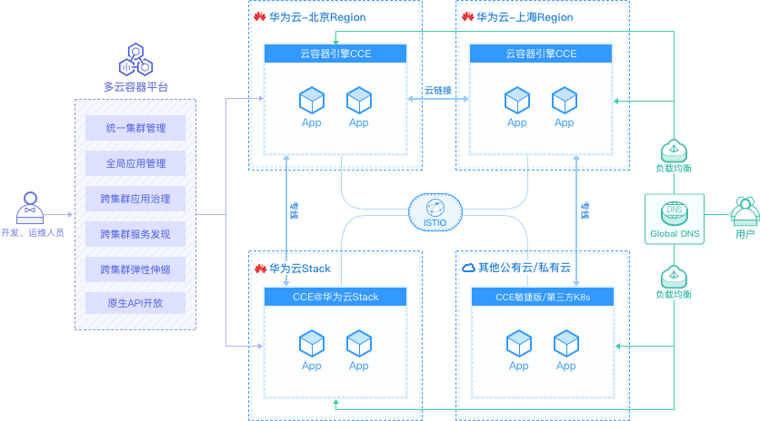
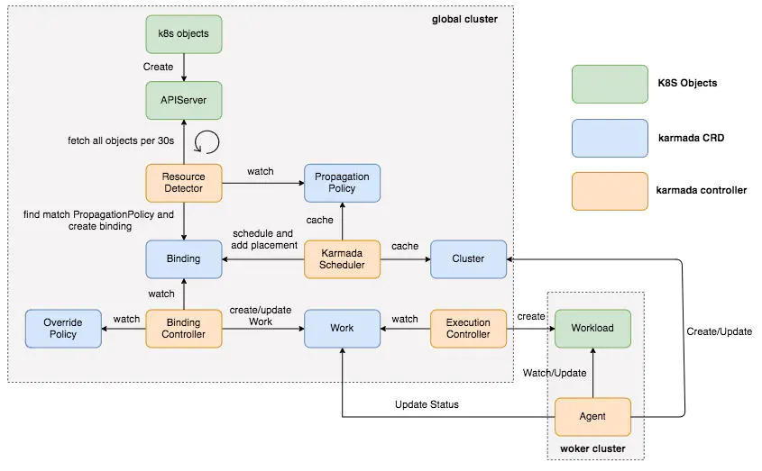

## 华为 Karmada 项目调研

1.  项目基本情况

  - Karmada 项目由华为、工商银行、小红书、中国一汽等8家企业联合发起，2020年12月4号发布了v0.1.0版本，半年时间已经发布了6个版本，平均一个月一个版本， 2021年4月25日正式对外开源，目前有1.5k 个star和145个fork,  而它上游已经存在了3年的项目kubefed 有1.7k star 和406个fork显然逊色许多
 -  前3名PR提交者全部来自华为，一个有27个contributors
 -  开源进展：在华为开发者大会 2021 上，华为云 CTO 张宇昕宣布云原生多云容器编排项目 Karmada 正式开源，未来还计划将该项目捐赠给云原生计算基金会 CNCF，但是并没有打算捐献给开放原子开源基金会

2.  落地案例

  - VIPKID在线教育平台： https://www.icode9.com/content-4-989425.html
  - Karmada | 工商银行多k8s集群管理及容灾实践： https://www.freeaihub.com/post/110554.html

3.  架构细节

- 完全copy k8s 原生3大组件 apiserver, controller-manager, scheduler, 也就是，其中apiserver自己独享，因此需要独立etcd,  并替换掉原生的controller-manager和scheduler，因此完全兼容原生k8s对象。
- 应用从单集群扩展为多集群时，不需要修改源文件，仅需要添加多集群的manifest包括PropagationPolicy和OverridePolicy，用户迁移和学习成本不大， 不像kubefed重新定义所有的k8s resource为kubefed resource
- kubectl需要切换context从而指定创建单体应用还是多集群应用
- 不支持Helm chart这种标准k8s应用程序多集群分发，从目前的架构上看也不好实现
- 不支持Publish和subscribe这种标准的Operator模式，也就是不支持多集群应用的full life cycle management：自动发布和升级
- 目前只实现了push mode, 因此要求混合云集群中的apiserver 有public IP 或者member集群apiserver可访问, 不过看code 它预留了pull mode， 后续会消除这个依赖(专线依赖)

```

const (
	// Push means that the controller on the karmada control plane will in charge of synchronization.
	// The controller watches resources change on karmada control plane then pushes them to member cluster.
	Push ClusterSyncMode = "Push"

	// Pull means that the controller running on the member cluster will in charge of synchronization.
	// The controller, as well known as 'agent', watches resources change on karmada control plane then fetches them
	// and applies locally on the member cluster.
	Pull ClusterSyncMode = "Pull"
)

```




4.  应用分发流程分析



- 用户在global集群中创建对象；
- Resource Detector会每30s去list集群中的所有资源，放到队列中；
- Resource Detector会对队列中的每个对象查找匹配的PropagationPolicy，创建Binding；
- 此时的Binding中没有targetCluster，而Karmada Scheduler会根据Cluster和PropagationPolicy计算调度结果，填入Binding的targetCluster；
- BindingController会watch OverridePolicy和Binding，创建Work(每个cluster会有一个namespace)；
- ExecutionControllerwatch到Work对象，提取spec.workload定义的对象，然后调用worker集群的client来创建和修改对象；
- worker集群的Agent则同样会watch Work对象并同步Workload的状态到Work；

 
5.  结论

- 目前不能直接满足需求，架构上独立etcd也难以维护，不过开发人员，维护人员，客户等上手容易，不需要学习过多的知识。


 

