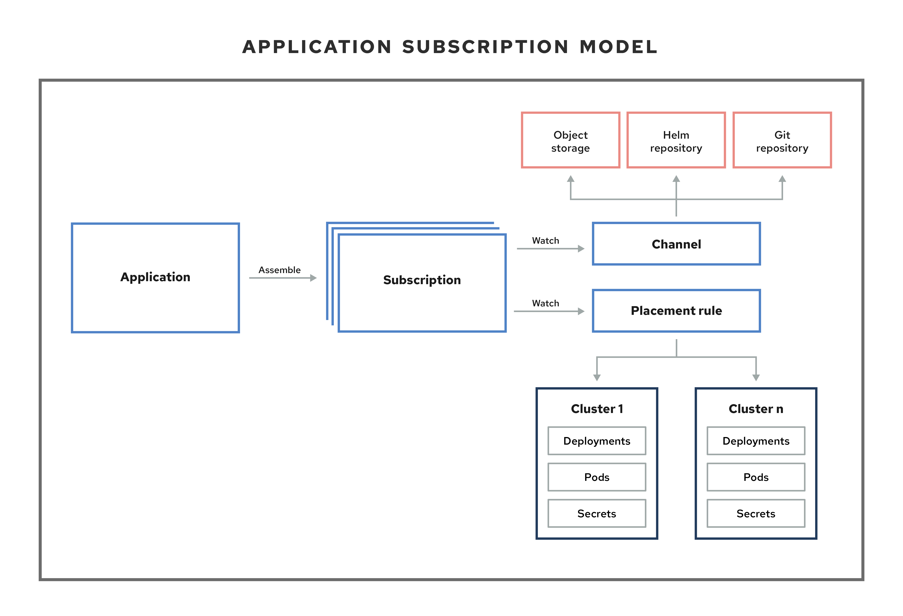
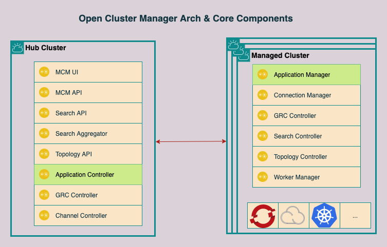

# Open Cluster Manager Application

## 1. Architecture


## 2. Application

Application(application.app.k8s.io) 用于对组成应用程序的 Kubernetes 资源进行分组。
[API](https://github.com/kubernetes-sigs/application/blob/master/api/v1beta1/application_types.go) | [Sample](#application-sample)

## 3. Subscription

Subscription(subscription.apps.open-cluster-management.io)允许集群订阅到一个源仓库（频道），它可以是以下类型：Git 仓库、Helm 发行 registry 或 Object Storage 仓库。
[API](https://github.com/open-cluster-management/multicloud-operators-subscription/blob/main/pkg/apis/apps/v1/subscription_types.go) | [Sample](#subscription-sample)

## 4. Channel

Channel(channel.apps.open-cluster-management.io) 定义了订阅的源仓库，它可以是以下类型：Git、Helm release 和 Object storage 仓库，以及 hub 集群上的资源模板。
[API](https://github.com/open-cluster-management/multicloud-operators-channel/blob/main/pkg/apis/apps/v1/channel_types.go) | [Sample](#channel-sample)

## 5. PlacementRule

PlacementRule(placementrule.apps.open-cluster-management.io) 定义了可部署资源模板的目标集群。使用放置规则帮助您促进可部署资源的多集群部署。放置策略也用于监管和风险策略。
[API](https://github.com/open-cluster-management/multicloud-operators-placementrule/blob/main/pkg/apis/apps/v1/placementrule_types.go) | [Sample](#placementrule-sample)

## 6. WorkFlow

IBM 多集群基础架构



多集群应用管理主要由一下5个Operator组成:

  - [multicloud-operators-application](https://github.com/open-cluster-management/multicloud-operators-application)
  - [multicloud-operators-channel](https://github.com/open-cluster-management/multicloud-operators-channel)
  - [multicloud-operators-deployable](https://github.com/open-cluster-management/multicloud-operators-deployable)
  - [multicloud-operators-placementrule](https://github.com/open-cluster-management/multicloud-operators-placementrule)
  - [multicloud-operators-subscription](https://github.com/open-cluster-management/multicloud-operators-subscription)

多集群应用工作流程:

  1. 在 `Hub` cluster 上创建 `Subscription`, `Channel`, `PlacementRule` 资源， `multicloud-operators-subscription` operator 会根据 `Channel`, `PlacementRule` 创建 `Deployable` 资源。

  1. 等待 `Deployable` 资源准备好后，`Managed` clusters 上面的 `Subscription` agent 会同步 `Hub` cluster 上面的 `Deployable` 资源，如果发现 `PlacementRule` 中包含自己，就会创建 `Deployable` template 的资源。

## 7. 示例

### Application Sample

```yaml
apiVersion: app.k8s.io/v1beta1
kind: Application
metadata:
  name: git-sub-app
  namespace: git-sub-ns
spec:
  componentKinds:
    - group: apps.open-cluster-management.io
      kind: Subscription
  descriptor: {}
  selector:
    matchLabels:
      name: git-sub
```

### Subscription Sample

```yaml
apiVersion: apps.open-cluster-management.io/v1
kind: Subscription
metadata:
  name: git-sub
  namespace: git-sub-ns
  labels:
    name: git-sub
  annotations:
    apps.open-cluster-management.io/github-path: git-ops/bookinfo/guestbook
spec:
  channel: ch-git/git
  placement:
    placementRef: 
      name: towhichcluster
      kind: PlacementRule
```

### Channel Sample

Git 类型的 channel

```yaml
apiVersion: apps.open-cluster-management.io/v1
kind: Channel
metadata:
  name: git
  namespace: ch-git
  labels:
    name: git-sub
spec:
  type: Git
  pathname: https://github.com/ianzhang366/acm-applifecycle-samples.git
```

HelmRepo 类型的 channel

```yaml
apiVersion: apps.open-cluster-management.io/v1
kind: Channel
metadata:
  name: dev-helmrepo
  namespace: dev
spec:
  type: HelmRepo
  pathname: https://charts.helm.sh/stable/
  insecureSkipVerify: true
```

### PlacementRule Samele

```yaml
apiVersion: apps.open-cluster-management.io/v1
kind: PlacementRule
metadata:
  name: towhichcluster
  namespace: git-sub-ns
  labels:
    name: git-sub
spec:
  clusterReplicas: 1
  clusterLabels:
    matchLabels:
      environment: Dev
```

### Deployable Sample

```yaml
apiVersion: apps.open-cluster-management.io/v1
kind: Deployable
metadata:
  annotations:
    apps.open-cluster-management.io/hosting-subscription: dev/nginx-sub
    apps.open-cluster-management.io/is-generated: "true"
    apps.open-cluster-management.io/is-local-deployable: "false"
  name: nginx-sub-deployable
  namespace: dev
  ownerReferences:
  - apiVersion: apps.open-cluster-management.io/v1
    blockOwnerDeletion: true
    controller: true
    kind: Subscription
    name: nginx-sub
    uid: 09d1691d-8c9f-428f-bc20-d76878f3c10c
spec:
  placement:
    placementRef:
      kind: PlacementRule
      name: nginx-pr
  template:
    apiVersion: apps.open-cluster-management.io/v1
    kind: Subscription
    metadata:
      annotations:
        apps.open-cluster-management.io/channel-generation: "1"
        apps.open-cluster-management.io/hosting-subscription: dev/nginx-sub
      name: nginx-sub
      namespace: dev
    spec:
      channel: dev/dev-helmrepo
      name: nginx-ingress
      packageFilter:
        version: 1.36.3
      placement:
        local: true
    status:
      ansiblejobs: {}
      lastUpdateTime: null
```

## 8. 结论：

基本满足所有的user case, 直接可用
